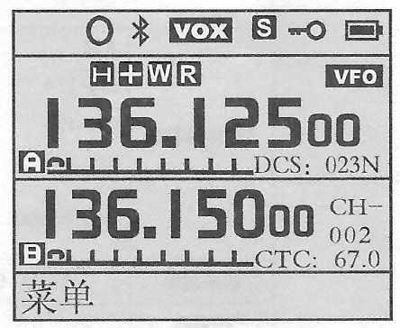
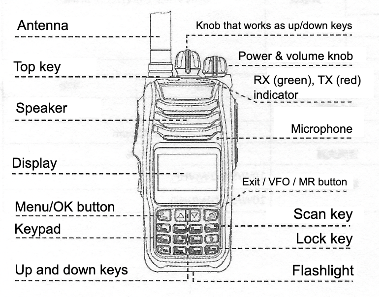

# How-To's for Lanchonlh HG-UV79 radio

# DISCLAIMER: this write-up can be inaccurate - there could be mistakes in translation or any other factual error. Also, the model you've got might have different software, hardware, or any other charactertics.

### Turning it on and off

Use the right knob at the top of the radio.

### How to switch the interface to English

Menu `18` - to get there, **on the keypad**, find the top-left button (green)
button, it is the Menu/OK button. Press it once, you'll see the actual menu.
Scroll to item 18 in the menu, click the same Menu/OK button to select the menu
item, you'll see language choices. Believe it or not, but `英⽂` is the one for
English, so select it, then press the same Menu/OK button again. Voila.

### Some specs

- Frequencies:
    - RX/TX: 136-174 MHz(FM)
    - RX/TX: 400-520 MHz(FM)
    - RX: 350-400 MHz (must be FM, but tbh not sure 100%)
    - RX: 64-108 MHz (FM)
    - RX: 109-136 MHz (AM)

  As you can see, the AM and FM ranges do not overlap. So you don't select "AM"
  or "FM" - you rather select a frequency.
- Dual-band. It can be set to work simultaneously on any two frequencies from
  the ranges above. Or you can opt-in to use just a single band.
- Supports 128 channels. Maybe a programming cord might help with entering them,
  but otherwise you'd need to enter each of the channels you need manually.
- Built-in Bluetooth, which I successfully connected to a couple of Bluetooth
  headsets including Sena 10R.
- Wireless PTT button, might come in the same box with the radio -
  check with your seller if they would supply one to you before you buy. There
  was no separate headset in the box.
- 50 CTCSS/210 DCS
- Selection of 1W, 5W or 10W for the output power.
- Li-Ion 4000 mAh battery, with Type-C charging socket.

### Display elements

- "o" symbol - shows up when the wireless PTT is connected.
- Bluetooth symbol - red when the Bluetooth is not connected, black when it is
  connected
- VOX - Voice control function
- S - battery save mode. There is not much info in the original manual about it
  apart from how to turn it on or off. It's different from the output power
  level.
- Key symbol - keyboard lock indicator.

If the dual-band mode is on (default), then the display is split between two
bands. Both are modifiable - the one that is bigger and also having the line of
status symbols (either top or bottom band, on the screenshot it is the top one)
is the one for which you enter the frequency/channel, output power, etc. You can
set up how to switch between the modifiabe bands, normally it should be one of
the side buttons.

The modifiable band has this status symbols:

- R - scramble indicator (not sure what's that)
- H, M, L - high, medium, low output power levels.
- "+" or "-" signs - when positive or negative frequency differences are on (not
  sure what's that)
- CTC - [CTCCS](https://www.google.com/search?q=CTCSS) indicator.
- DCS - [DCS](https://en.wikipedia.org/wiki/Squelch#DCS) indicator.
- W/N - broadband mode, wide and narrow respectively. See
  the `Bandwidth setting` section below for some discussion on it.
- VFO/MR - VFO is when you enter frequencies directly, MR is when you're
  operating on channels. Notice that even in MR mode the frequency might be
  shown, there a separate setting for that.

### Exterior

 

### Bandwidth setting

Menu `04 WN` - there is this little setting, the default value for which might
make things a bit messy for your purposes - the Bandwidth setting, with `NARR`
and `WIDE` (the default) options. I found that if it is set to `WIDE`, it's
actually wide, and the handset can unlock the squelch when some nearby frequency
is used.

By "nearby" I mean something practically close, e.g. if you're on an Aussie CB
channel, a transmission on the next or prev one might unlock the squelch, and
you can hear the conversation there - which I found to be a bit crazy. So I'd
recommend changing it to Narrow (`NARR`).

## To be continued...

If you're stuck, see the original scanned manual in
the [main srepo](https://github.com/new-mikha/HG-UV79/blob/1f96ab0eec85dc48a5e18d666499689ae0f4e9de/original-manual-scan/LANCHONLH%20HG-UV79%20-%20manual%20-%20OCR%20by%20Adobe.pdf).
It's a scan of a manual in Chinese, but it's text-recognized - **YOU'D NEED TO
DOWNLOAD THE FILE FOR THAT. BECAUSE AS OF NOW, THE TEXT COPY-PASTE DOES NOT WORK
ON GITHUB, YOU NEED TO OPEN IT IN A PROPER ACROBAT READER**. So even though the
original manual is not in English, it's still possible to copy-paste parts of it
into Google Translate.