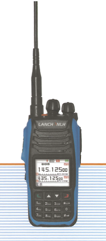
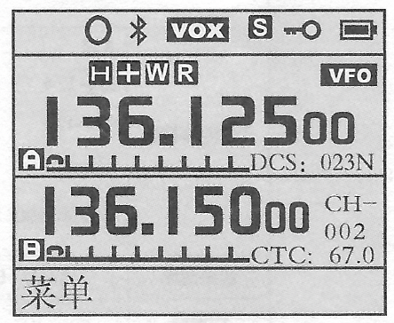
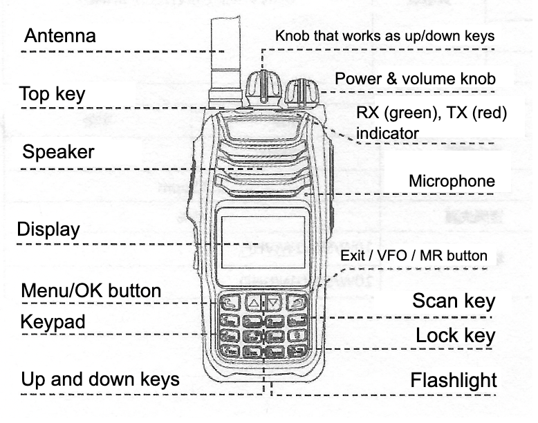
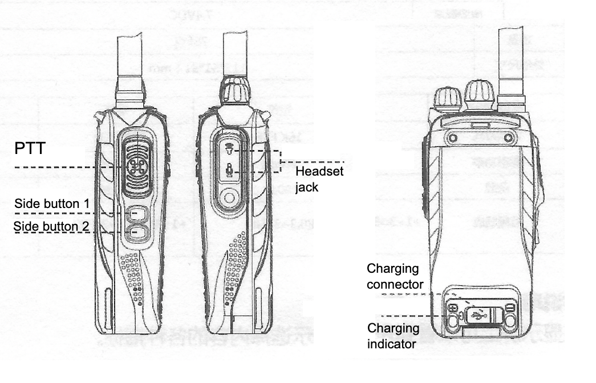
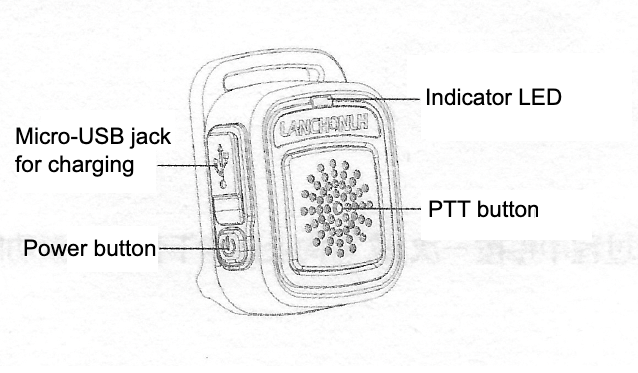

# Lanchonlh HG-UV79

## Pre-face

**DISCLAIMER: This write-up can be inaccurate - there could be translation
mistakes or any
other errors. Also, the radio model is subject to change, in regard to either
software, hardware, or any other charactertics.**

**Please note also that it's not a direct translation - it's more like
*How-To*'s for English-speaking users.** You can view the scan of the original
manual in the `original-manual-scan` directory.

## How-To's, specs, pics

### - First things first - how to switch the interface to English

Menu `18` - to get there, **on the keypad**, find the top-left button (green)
button, it is the Menu/OK button. Press it once, you'll see the actual menu.
Scroll to item 18 in the menu, click the same Menu/OK button to select the menu
item, you'll see language choices. Believe it or not, but `英⽂` is the one for
English, so select it, then press the same Menu/OK button again. Voila.

### - Some specs

- Frequencies:
    - RX/TX: 136-174 MHz(FM)
    - RX/TX: 400-520 MHz(FM)
    - RX: 350-400 MHz (must be FM, but tbh not sure 100%)
    - RX: 64-108 MHz (FM)
    - RX: 109-136 MHz (AM)

  As you can see, the AM and FM ranges do not overlap. So you don't select "AM"
  or "FM" - you rather select a frequency.
- Dual-band. It can be set to work simultaneously on two frequencies from
  the ranges above. It seems it needs at least one of the bands to be TX'able.
  Or you can opt-in to use just a single band.
- Supports 128 channels. Maybe a programming cord might help with entering them,
  but otherwise you'd need to enter each of the channels you need manually.
- Built-in Bluetooth, which I successfully connected to a couple of Bluetooth
  headsets including Sena 10R.
- Remote PTT button, might come in the same box with the radio -
  check with your seller if they would supply one to you before you buy. There
  was no separate headset in the box.
- 50 CTCSS/210 DCS
- Selection of 1W, 5W or 10W for the output power.
- Li-Ion 4000 mAh battery, with Type-C charging socket.

### - Display elements

- `o` symbol - shows up when the remote PTT is connected.
- `ᛒ` symbol, Bluetooth - red when the Bluetooth is not connected, black when it
  is connected
- `VOX` - Voice control function
- `S` - battery save mode. There is not much info in the original manual about
  it
  apart from how to turn it on or off. It's different from the output power
  level.
- Key symbol - keyboard lock indicator.

If the dual-band mode is on (default), then the display is split between two
bands. Both are modifiable - the one that is bigger and also having the line of
status symbols (either top or bottom band, on the screenshot it is the top one)
is the one for which you enter the frequency/channel, output power, etc. You can
set up how to switch between the modifiabe bands, normally it should be one of
the side buttons.

The modifiable band has this status symbols:

- R - scramble indicator (not sure what's that)
- H, M, L - high, medium, low output power levels.
- "+" or "-" signs - when positive or negative frequency differences are on (not
  sure what's that)
- CTC - [CTCCS](https://www.google.com/search?q=CTCSS) indicator.
- DCS - [DCS](https://en.wikipedia.org/wiki/Squelch#DCS) indicator.
- W/N - broadband mode, wide and narrow respectively. See
  the `Bandwidth setting` section below for some discussion on it.
- `VFO`/`AM`/`FM` - VFO is the mode when you can enter frequencies directly, as
  opposed to the channel mode. Although `VFO` is shown for the TX'able
  frequencies only, while to RX-only frequencies you see either `AM` or `FM` and
  no channel number in the VFO mode. The channel mode otherwise called "MR" but
  it's not shown on the display like that.

### - Exterior

 

### - Keys lock/unlock

Press and hold the bottom-right key (with the hash sign), this locks and unlocks
the keyboard.

There is also a setting that control what exactly is locked. See the
menu `28 LOCKMODE`, it has the following options:

- `KEY` - just the keypad is locked by the lock key.
- `KEY+DIAL` - keypad and the dial on top are locked by the lock key.
- `KEY+DIAL+PTT` - keypad, the dial on top, and all side buttons are locked by
  the lock key.

### - Bandwidth setting

Menu `04 WN` - there is this little setting, the default value for which might
make things a bit messy for your purposes - the Bandwidth setting, with `NARR`
and `WIDE` (the default) options. I found that if it is set to `WIDE`, it's
actually wide, and the handset can unlock the squelch when some nearby frequency
is used.

By "nearby" I mean something practically close, e.g. if you're on an Aussie CB
channel, a transmission on the next or prev one might unlock the squelch, and
you can hear the conversation there - which I found to be a bit crazy. So I'd
recommend changing it to Narrow (`NARR`).

### - CTCSS (or DCS)

Menu items `13 TX_CTC` and `15 RX_CTC` for CTCSS. Set up both to the same value.
For DCS, use menus 12 and 14.

### - Setting side buttons up, e.g. for switching modifiable band or for toggling squelch up

Menu items starting from `31 PF1-SHORT` (short press to side button 1) up
to `36 TOP-LONG` (long press to the top button) are controlling what happens on
the corresponding actions. Settings might be, for example:

- `SQL_KEY` for the side button 1 - this would toggle the squelch on and off.
- `KEY_AB` for the side button 2 - this scrolls between bands in the dual bands
  mode.
- `LAMP` for the top button to toggle the flashlight on and off.
- ... or something different in according to your own preferences.

### - Output power

Menu `05 TXP`. Available options are `L` for 1W, `M` for 5W, `H` for 10W.

### - Dual band/single band

Menu `16 TDR`. Here things become a bit tricky - at least in my radio, this
setting is not translated. So the values are:

- `DAN` - single band.
- `SHUANG` - dual band.

Also, as it seems, the radio needs at least one of the bands to be TX'able.

### - Scrolling through channel/frequency modes

If you already have some channels, you might be in the channel mode. If so, then
**long** press of the top-right button on the keypad (the red button) scrolls
between frequency mode and flavours of the channel mode:

- Frequency mode - if the frequency is TX'able, you'll see the actual
  frequency +`VFO`
- Channel mode, just channel number shown in the big font.
- Channel mode, both frequency and the channel number are shown, the latter in
  the small font. *This one is easy to confuse with "just frequency" mode*.

### - Frequency step

Menu `O3 STEP`. In the Frequency mode (see the section above), you can enter the
frequency on the keypad, or scroll to the next one by either pressing up/down
buttons, or turning the dial on top. With such scrolling, the `03 STEP` menu is
important. It becomes quite imoprtant when saving multiple channels (see below),
if your channels are spread evenly.

### - Saving channels

IMPORTANT - a channel keeps not just the frequency, but a lot of other things:

- Narrow/wide setting (see above)
- CTCSS/DCS setting (see above)
- Output power
- Stuff related to e.g. frequency differences etc.

So if you forgot about it, then you might end up with one channel having Narrow
bancwidth, while other suddenly becomes Wide and you start hearing chatters
from the other channels. Keeping that in mind, set up all those things first
before you start saving the channels.

First, make sure you're in the frequency mode - "just frequency" mode, see the
**"Scrolling through channel/frequency modes"** section above. Then do this:

- Enter all the details - is it narrow/wide bandwidth, output power, etc.
- Set the frequency, either by number on the keypad, or by scrolling to the
  next one by using either up/down buttons, or the dial on top (see the
  "Frequency step" section above)
- Go to the `37 MEM-CH` menu item, select the channel, press OK.
- Repeat for all channels that you need. This might take time!

### - Turning the Bluetooth on and off

Normally it's on, but if you don't see the Bluetooth symbol (ᛒ) on the display
either blinking or solid, go to the menu `47 Bluetooth_SET`, then to
the `1. BT Switch` sub-menu, make it `ON` there - and check that the (ᛒ) is now
showing up on the display.

After you turn it on, it probably will be red and blinking - that's ok so far,
just means no Bluetooth headset is connected yet.

### - Remote PTT buttons

Here is how the supplied remote PTT looks like:

### - Pairing of the supplied remote PTT

The procedure below is for the supplied remote PTT button, shown on the picture
above.

- Make sure the Bluetooth connectivity is on in general, you might refer to the
  [Turning the Bluetooth on and off](#--turning-the-bluetooth-on-and-off)
  section
  above to make it ON.
- Now for the remote, switch the remote off if it's not yet. Check it then -
  press the remote PTT button, its indicator should NOT light up.
- Go to the menu `47 Bluetooth_SET`, then to the `2. Ring pairing` sub-menu,
  make it `ON` - see the `Pairing...` message.
- Now do this with the remote - follow these steps carefully:
    - With the remote initially off (see above), press and hold the remote's PTT
      button.
    - Then press its Power button quickly - until you see the red light on the
      remote, then release the Power button, **but keep holding the PTT
      button**.
    - You must see the red indicator on the remote blinking quickly for a
      while - and then it should go off after a few seconds, while the main unit
      saying `Success`. You can release the PTT button now.

If you did everything correctly, then voila - you'll see the (`o`) symbol on the
main unit display, and now pressing PTT on the remote makes the radio
transmitting (make sure you're on TX'able frequency!). It works even with the
full keypad lock, when the main unit's PTT is blocked - but the remote PTT
still works.

### - Remote headset pairing

This is more generic procedure than the one for the remote PTT described above,
but hopefully easier too. Refer to the headset manual for the details on how to
start pairing on its side. For the radio unit the procedure is just this:

- Make sure the Bluetooth connectivity is on in general, you might refer to the
  [Turning the Bluetooth on and off](#--turning-the-bluetooth-on-and-off)
  section above to make it ON.
- Go to the menu `47 Bluetooth_SET`, then to the `5. BT pairing` sub-menu,
  make it `ON` - see the `Pairing...` message.
- ... do whatever your headset requires for pairing. Just a tip - say, Sena 10R
  headset should follow the procedure for pairing with a ***phone*** when
  pairing to this radio.

### - Bluetooth speaker volume

A couple of findings:

- The Bluetooth headset speaker volume is NOT controlled by the main unit's
  Power/Volume knob, at least with the headsets I tested. You can change the
  volume by the headset control though, which might be ok.
- There is a menu: `47 Bluetooth_SET`/`3.BT_VOL`, with options from 1 to 16. It
  slightly changes the volume in the Bluetooth headset speaker. So if you find
  that your one is too quiet, you can try change it to 16 there and then play
  with your actual Bluetooth headset volume controls.

### - Bluetooth microphone volume

You can find out that you're too quiet for your buddies who're listening what
you're talking over the Bluetooth headset microphone using this radio. There is
a setting that looks like it should change the Bluetooth microphone
gain: `47 Bluetooth_SET`/`3.BT_MIC`. Unfortunately, in my tests I found that
this setting effectively changes nothing. No matter what value I set, the was no
noticeable change in the microphone level.

## The rest of the menu items

TODO

## To be continued . . .

If you're stuck, see the original scanned manual in
the [main srepo](https://github.com/new-mikha/HG-UV79/blob/1f96ab0eec85dc48a5e18d666499689ae0f4e9de/original-manual-scan/LANCHONLH%20HG-UV79%20-%20manual%20-%20OCR%20by%20Adobe.pdf).
It's a scan of a manual in Chinese, but it's text-recognized - **YOU'D NEED TO
DOWNLOAD THE FILE FOR THAT. BECAUSE AS OF NOW, THE TEXT COPY-PASTE DOES NOT WORK
ON GITHUB, YOU NEED TO OPEN IT IN A PROPER ACROBAT READER**. So even though the
original manual is not in English, it's still possible to copy-paste parts of it
into Google Translate.